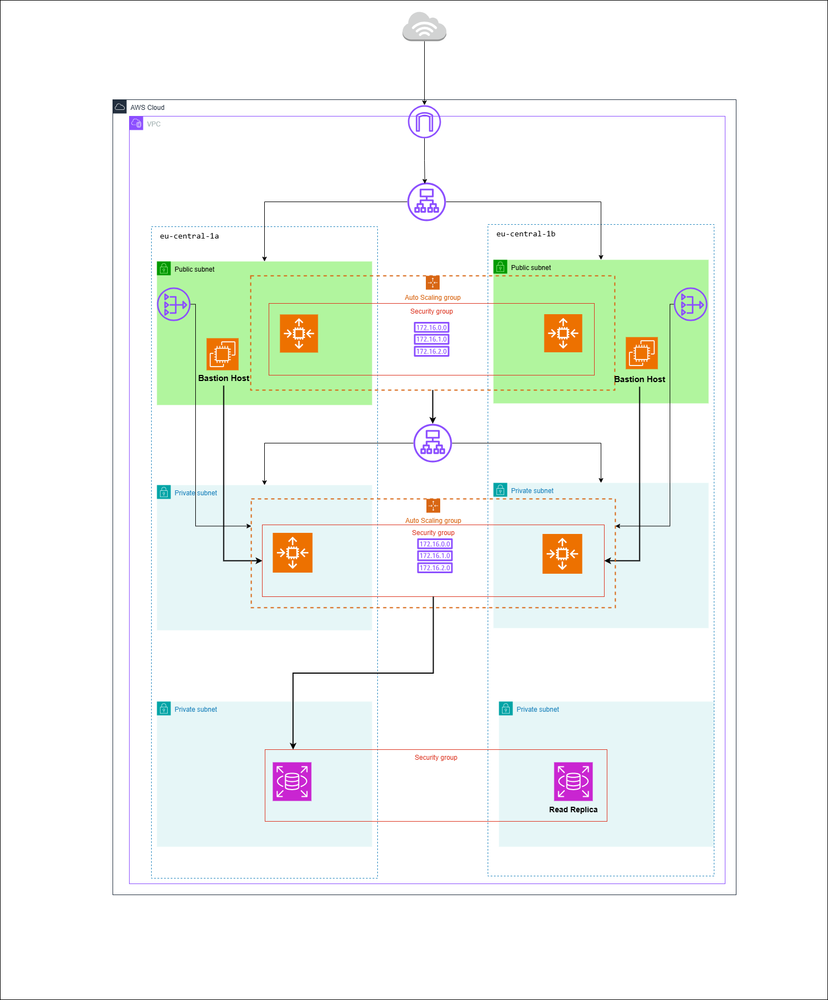

# Multi-Tier Architecture on AWS with Terraform

A production-ready **3-tier AWS infrastructure** provisioned entirely with Terraform, covering Web, Application, and Database layers across two Availability Zones for high availability.



---

## Architecture Overview

```
Internet
   │
   ▼
[Internet Gateway]
   │
   ▼
[Web ALB] ── Public Subnets (AZ-a, AZ-b)
   │              │
   │         [Bastion Hosts]
   ▼
[Web ASG] ── EC2 instances (Apache)
   │
   ▼
[App ALB] ── Private Subnets (AZ-a, AZ-b)
   │
   ▼
[App ASG] ── EC2 instances
   │
   ▼
[RDS MySQL] ── DB Subnets (Multi-AZ)
```

### Tiers

| Tier | Resources | Subnets |
|------|-----------|---------|
| Web | ALB, ASG (min:1 / desired:2 / max:4), Apache EC2 | Public `10.0.1.0/24`, `10.0.2.0/24` |
| App | Internal ALB, ASG (min:1 / desired:2 / max:4), EC2 | Private `10.0.3.0/24`, `10.0.4.0/24` |
| DB  | RDS MySQL 8.0 (Multi-AZ), Subnet Group | Private `10.0.5.0/24`, `10.0.6.0/24` |

---

## Project Structure

```
AWS/
├── provider.tf               # AWS provider configuration
├── variables.tf              # All input variables
├── vpc.tf                    # VPC (10.0.0.0/16)
├── internet-gateway.tf       # Internet Gateway
├── nat-gw.tf                 # NAT Gateways (one per AZ)
├── eip.tf                    # Elastic IPs for NAT Gateways
├── public-route-table.tf     # Route table for public subnets
├── private-route-table.tf    # Route table for private subnets
├── web-subnets.tf            # Public subnets (Web Tier)
├── app-subnets.tf            # Private subnets (App Tier)
├── db-subnets.tf             # Private subnets (DB Tier)
├── db-subnets-group.tf       # RDS Subnet Group
├── alb-web.tf                # External ALB (Web Tier)
├── alb-web-sg.tf             # Security Group for Web ALB
├── alb-app.tf                # Internal ALB (App Tier)
├── alb-app-sg.tf             # Security Group for App ALB
├── tg-web.tf                 # Target Group for Web ALB
├── tg-app.tf                 # Target Group for App ALB
├── launch-template-web.tf    # Launch Template for Web EC2
├── launch-template-app.tf    # Launch Template for App EC2
├── asg-web.tf                # Auto Scaling Group (Web)
├── asg-web-sg.tf             # Security Group for Web ASG
├── asg-app.tf                # Auto Scaling Group (App)
├── asg-app-sg.tf             # Security Group for App ASG
├── ec2-bastion-host.tf       # Bastion Hosts (public subnets)
├── bastion-host-sg.tf        # Security Group for Bastion Hosts
├── rds.tf                    # RDS MySQL instance
├── db-sg.tf                  # Security Group for RDS
├── user-data-web.sh          # Bootstrap script (Apache install)
├── output.tf                 # Outputs (Web ALB DNS)
├── secret.tfvars             # DB credentials (not committed)
└── variables.tf              # Variable definitions & defaults
```

---

## Prerequisites

- [Terraform](https://developer.hashicorp.com/terraform/downloads) >= 1.0
- [AWS CLI](https://aws.amazon.com/cli/) configured with appropriate credentials
- An existing EC2 Key Pair in the target region

---

## Configuration

### Required Variables

Override defaults by creating a `terraform.tfvars` file or passing `-var` flags:

| Variable | Description | Default |
|----------|-------------|---------|
| `region` | AWS region | `eu-central-1` |
| `availability-zones` | List of AZs | `["eu-central-1a", "eu-central-1b"]` |
| `vpc-cidr-block` | VPC CIDR | `10.0.0.0/16` |
| `image-id` | AMI ID for EC2 instances | `ami-0a5b0d219e493191b` |
| `instance-type` | EC2 instance type | `t3.micro` |
| `key-name` | EC2 Key Pair name | `YourKeyPairName` |
| `db-class` | RDS instance class | `db.t3.micro` |
| `db-name` | RDS database name | `NameDB` |

### Sensitive Variables (secret.tfvars)

Create `AWS/secret.tfvars` with your DB credentials — **never commit this file**:

```hcl
db-username = "<your-db-username>"
db-password = "<your-db-password>"
```

> `secret.tfvars` and `terraform.tfstate` are listed in `.gitignore`.

---

## Deployment

```bash
cd AWS

# 1. Initialize Terraform
terraform init

# 2. Preview the plan
terraform plan -var-file="secret.tfvars"

# 3. Apply the infrastructure
terraform apply -var-file="secret.tfvars"
```

After a successful apply, the Web ALB DNS name is printed as output:

```
Outputs:
web-server-dns = "web-alb-<id>.eu-central-1.elb.amazonaws.com"
```

### Destroy

```bash
terraform destroy -var-file="secret.tfvars"
```

---

## Security Findings

The code review identified the following issues to address before production use:

| Severity | File | Issue |
|----------|------|-------|
| High | `ec2-bastion-host.tf` | EBS volumes not encrypted |
| High | `ec2-bastion-host.tf`, `launch-template-web.tf` | Public IP assigned to EC2 instances |
| High | `rds.tf` | RDS encryption at rest disabled |
| Medium | `ec2-bastion-host.tf` | Detailed EC2 monitoring disabled |
| Medium | `alb-web.tf`, `alb-app.tf` | ALB not dropping invalid HTTP headers |
| Medium | `tg-web.tf`, `tg-app.tf` | Target groups using HTTP instead of HTTPS |
| Medium | `rds.tf` | IAM authentication disabled for RDS |

> See the Code Issues panel for detailed remediation guidance.

---

## Networking

- VPC CIDR: `10.0.0.0/16`
- 2 NAT Gateways (one per AZ) for private subnet outbound traffic
- 2 Bastion Hosts in public subnets for SSH access to private instances
- Public Route Table → Internet Gateway
- Private Route Table → NAT Gateway

---

## License

This project is provided for educational and demonstration purposes.
